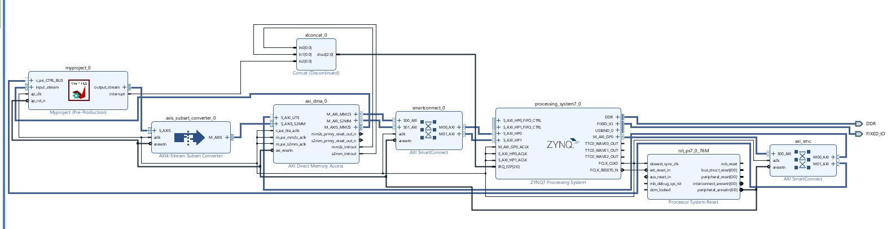

# Project Report

**Project Title:** Custom CNN Model for Mask Detection with Hardware Acceleration  
**Institution:** Tezpur University  
**Target Platform:** Xilinx Zynq-7000 SoC (ZedBoard xc7z020-clg484-1)  

---

## 1. Methodology
The primary objective of this project was to implement a real-time, edge-AI face mask detection system by balancing convolutional neural network (CNN) accuracy with the strict resource constraints of an embedded System-on-Chip (SoC). 

We employed a **Hardware/Software Co-design Strategy**:
* **Processing System (PS - ARM Cortex-A9):** Responsible for video capture, dynamic Region of Interest (ROI) extraction using OpenCV Haar Cascades, and system-level synchronization.
* **Programmable Logic (PL - FPGA Fabric):** Acts as a custom hardware accelerator to execute the heavy mathematical computations of the CNN.

**AI Architecture:**
A custom, lightweight 3-layer CNN was developed to distinguish mask fabric from facial features and shadows.
* **Input Shape:** 150 x 150 x 3 (RGB)
* **Feature Extraction:** 3 cascaded Conv2D layers (16, 32, and 64 filters) with MaxPooling.
* **Classification:** Global Average Pooling leading to a Dense classifier.

---

## 2. Hardware Utilization
The CNN algorithm was synthesized into Register-Transfer Level (RTL) hardware using Xilinx Vitis HLS. The implementation is highly optimized, maximizing the logic capabilities of the Zynq-7020 chip without exceeding its limits.

**Vivado HLS Resource Estimates:**

| Hardware Resource | Used | Available | Utilization |
| :--- | :--- | :--- | :--- |
| **LUT (Look-Up Tables)** | 46,874 | 53,200 | 88% |
| **DSP48E Slices** | 78 | 220 | 35% |
| **FF (Flip-Flops)** | 26,131 | 106,400 | 24% |
| **BRAM_18K (Block RAM)** | 51 | 280 | 18% |

---

## 3. Optimization Techniques
To transition from a software-bound bottleneck to real-time hardware execution, several critical optimization techniques were applied:

* **Fixed-Point Quantization (`ap_fixed<16, 8>`):** Floating-point arithmetic was completely eliminated in the PL. All model weights and activations were quantized to 16-bit fixed-point integers. By allocating 8 bits to the fractional component, the system maps raw 8-bit image pixels (0-255) directly into hardware without requiring expensive floating-point normalization on the CPU.
* **Direct Memory Access (DMA) Handshaking:** A race condition between the AXI-DMA and the AI IP was eliminated using explicit software-to-hardware handshaking. Auto-restart was disabled, and the IP execution (`0x01`) is triggered only after the memory buffers are primed.
* **High-Speed Memory Casting:** Python system-call overhead was bypassed by formatting frame data in CPU RAM and bursting it to the Contiguous Memory Allocator (CMA) via `np.copyto()`. 
* **HLS Pipelining:** Dataflow directives and loop unrolling were implemented in C++ to allow the 78 active DSP slices to process multiple convolutional filters simultaneously.

---

## 4. Results and Performance Metrics
The hardware acceleration provided a massive improvement in system throughput and inference latency, proving the viability of the Zynq-7000 for edge-AI applications.

**Speed & Throughput:**
* **CPU Inference Latency:** ~380ms to 450ms
* **FPGA Inference Latency:** ~26.0ms (Practical measured) / 39.5ms (Theoretical max)
* **Speedup Factor:** **~15x reduction** in inference time, stabilizing the video feed from 2.2 FPS up to 15.0 FPS.

**Accuracy Trade-off:**
* **CPU Baseline Accuracy (Float32):** ~85%
* **FPGA Accelerator Accuracy (Int16):** ~70% - 80%
* **Analysis:** A slight drop in classification accuracy was observed. This is a known and acceptable trade-off in embedded engineering caused by the quantization from 32-bit floating-point precision to 16-bit fixed-point precision. Despite this, the system remains highly capable of real-time binary classification.

**Conclusion:**
By successfully migrating the convolutional workload from the ARM PS to the FPGA PL, the project achieved a 15x acceleration in mathematical execution. The resulting system is a robust, real-time edge device capable of effective mask detection.
